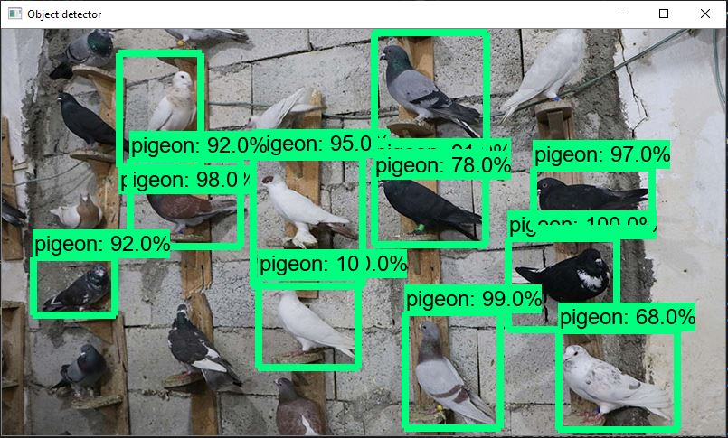
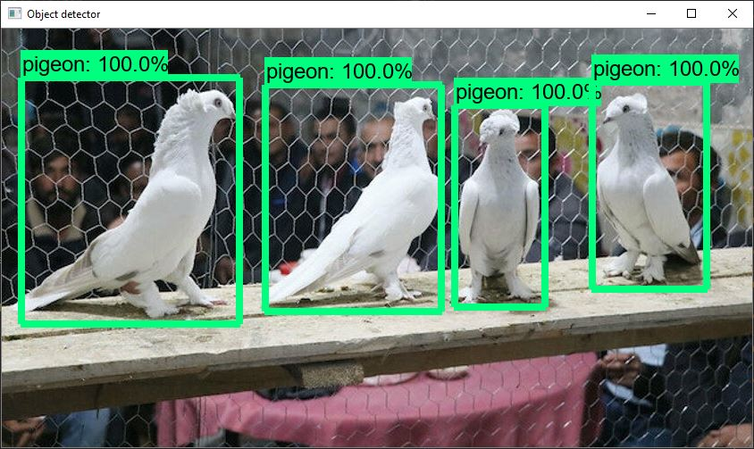

**Bu model aşağıdaki video üzerinde adımlar izlenerek güvercin tespit sistemine uyarlanmıştır.**
**This model has been adapted to the pigeon detection system by following the steps on the video below.**

5 saat eğitilen model sonuçunda yüzde 95'lik bir doğruluk oranı elde ettik. Aşağıda bir kaç çıktı örneği görebilirsiniz.

We trained this model for 5 hours. We achieved an accuracy rate of 95 percent in the model. You can see a few examples below.

  

  

Projeyi çalıştırmak için object_detection_image ve object_detection_video üzerinden IMAGE_NAME değişkenine proje dosyasına atmış olduğunuz fotoğrafın ismini ve uzantısı yazarak test edebilirsiniz.

In order to run the project, you can test it by typing the name and file extension of the photo you have uploaded to the project file in the IMAGE_NAME variable in object_detection_image and object_detection_video.
